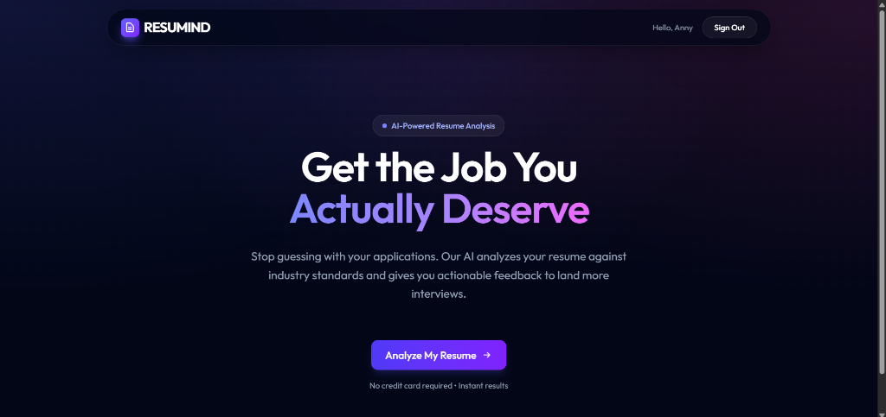
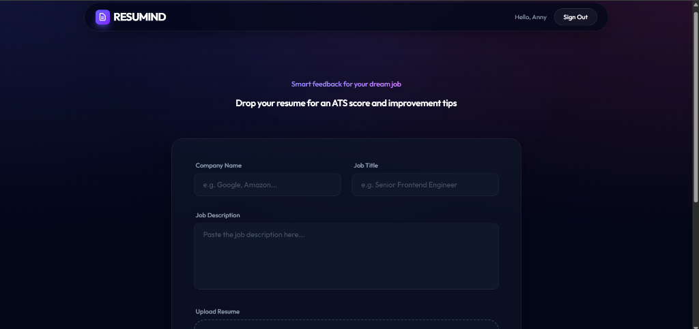
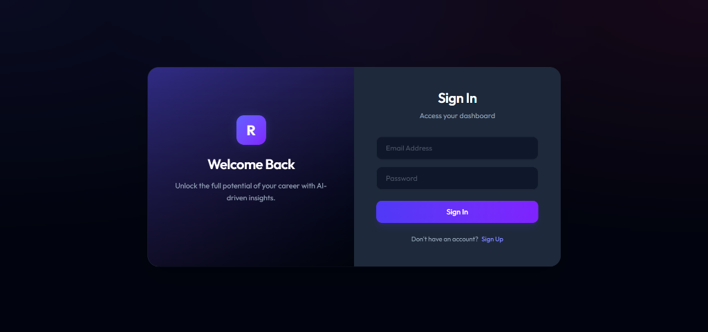
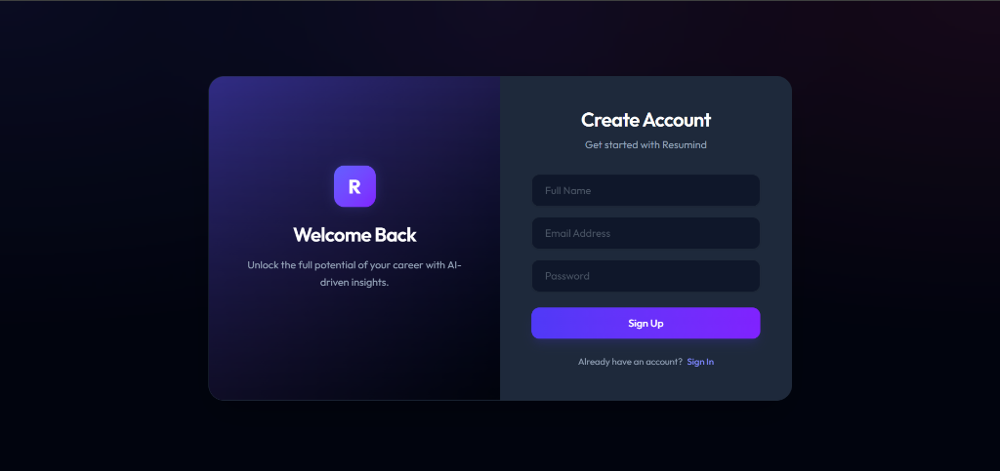
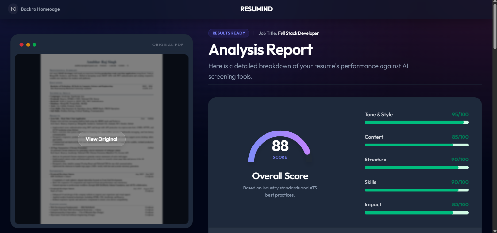

# Resumind - AI-Powered Resume Analyzer

Resumind is a state-of-the-art web application designed to help job seekers optimize their resumes using Artificial Intelligence. By analyzing resumes against industry standards and specific job descriptions, Resumind provides actionable feedback, ATS (Applicant Tracking System) scores, and detailed insights to improve employment prospects.

## 🚀 Features

- **AI Analysis**: Leverages Google Gemini AI to provide deep insights into resume content, structure, tone, and impact.
- **ATS Scoring**: Calculates an overall score based on common screening parameters used by recruiters.
- **PDF Processing**: Seamlessly handles PDF uploads and generates visual previews using `pdf.js`.
- **Dynamic Feedback**: Provides category-specific scores for Tone & Style, Content, Structure, Skills, and Impact.
- **Secure Authentication**: Custom-built secure login and signup system with JWT and bcrypt protection.
- **User Dashboard**: Keep track of your analysis history and access past reports instantly.
- **Premium UI**: Modern dark-themed interface with glassmorphism effects and responsive design.

## � Screenshots

| Landing Page | Upload Section |
| :---: | :---: |
|  |  |

| Sign In | Sign Up |
| :---: | :---: |
|  |  |

| Analysis Results |
| :---: |
|  |

## �🛠️ Tech Stack

### Frontend
- **Framework**: React 19 (Vite)
- **Routing**: React Router 7
- **State Management**: Zustand
- **Styling**: Tailwind CSS 4
- **PDF Logic**: PDF.js (`pdfjs-dist`)

### Backend
- **Runtime**: Node.js
- **Framework**: Express.js
- **Database**: MongoDB (Mongoose)
- **AI Engine**: Google Generative AI (Gemini Pro)
- **File Handling**: Multer (Local Disk Storage)
- **Security**: JSON Web Tokens (JWT) & bcryptjs

## 📁 Project Structure

```text
├── ai-resume-analyzer-main/  # Frontend (Vite + React)
│   ├── src/
│   │   ├── components/      # Reusable UI components
│   │   ├── lib/             # API clients, utilities, and AI logic
│   │   ├── routes/          # Page routes (Home, Auth, Upload, Resume)
│   │   ├── App.jsx          # Root component & Routing
│   │   └── main.jsx         # Application entry point
│   ├── public/              # Static assets (images, worker scripts)
│   ├── index.html           # HTML entry
│   └── vite.config.js       # Vite configuration
│
└── backend/                 # Backend (Node.js + Express)
    ├── controllers/         # API logic (Auth, AI, File System)
    ├── models/              # Database schemas (User)
    ├── routes/              # API endpoints
    ├── uploads/             # Temporary storage for resumes
    ├── server.js            # Server entry point
    └── .env                 # Environment variables (API Keys, DB URI)
```

## ⚙️ Setup Instructions

### Prerequisites
- Node.js (v18+)
- MongoDB (Local or Atlas)
- Google Gemini API Key

### Backend Setup
1. Navigate to the `backend` directory.
2. Install dependencies:
   ```bash
   npm install
   ```
3. Create a `.env` file and add the following:
   ```env
   PORT=3000
   MONGO_URI=your_mongodb_connection_string
   JWT_SECRET=your_jwt_secret
   GEMINI_API_KEY=your_gemini_api_key
   ```
4. Start the server:
   ```bash
   npm run dev
   ```

### Frontend Setup
1. Navigate to the `ai-resume-analyzer-main` directory.
2. Install dependencies:
   ```bash
   npm install
   ```
3. Start the development server:
   ```bash
   npm run dev
   ```
4. Open the app at `http://localhost:5173`.

## 🛡️ Security & Privacy
- Resumes are stored locally in the `uploads/` folder and can be managed/deleted.
- Authentication is handled via stateless JWT tokens stored securely on the client side.
- AI analysis is performed using transient payloads to ensure data privacy where possible.

## 🤝 Contributing
Contributions are welcome! Please feel free to submit a Pull Request.

---
Developed as a **Final Year Project** for advanced AI-driven career tools.
